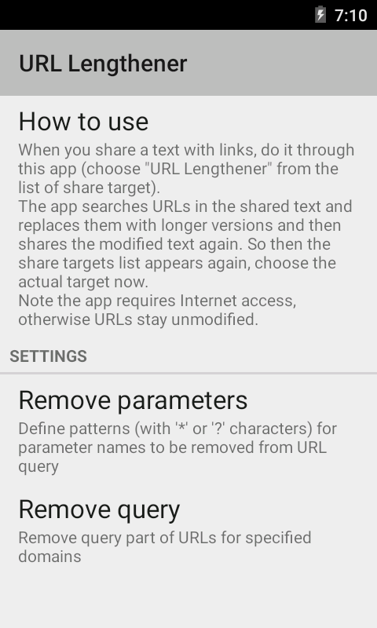
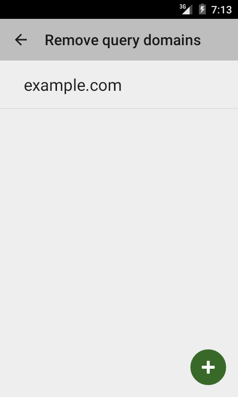

This is a small tool for Android devices.

Motivation
----------

Tweets have shortened URLs.
RSS feeds have URLs which points to ads or counters.
However, the original long URL is more informative and is easier to remember.

The tool is to expand (lengthen) URLs in shared text
which you send from your Twitter or RSS reader application to email, chat, etc.
You should just pass the text through the "lengthener".

Download
--------

* [Google Play](https://play.google.com/store/apps/details?id=ru.gelin.lengthener.android)

Screenshots
-----------

